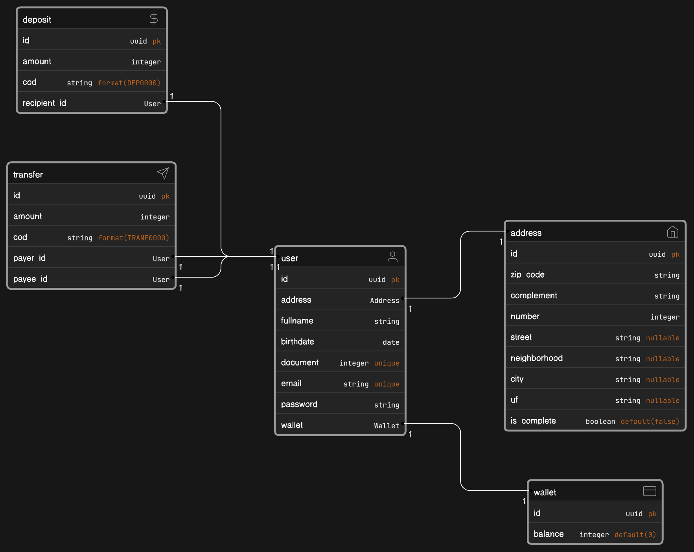

# Processo seletivo Ultralinks 🚀

## Tecnologias

Esse projeto utiliza as seguintes tecnologias:


## Requisitos

Para rodar o projeto você precisa ter o docker instalado. Só isso 🐋💕.

## Rodando o projeto ☕

Para iniciar o projeto você precisa clonar esse repositório com o seguinte comando:

```bash
git clone https://github.com/janinemo/ultralinks.git JanineMachadoOliveira_UltralinksProcessoSeletivo
cd JanineMachadoOliveira_UltralinksProcessoSeletivo
```

Depois basta iniciar um container no docker com o comando `docker-compose` 🐋

```bash
docker-compose up -d
```

Se preferir você pode acessar o container do serviço de api 

```bash
docker-compose exec users_microservice bash
```

Instale as dependências por meio do `composer`

```bash
composer install
```

E popular os dados do banco utilizando o `artisan` 

```bash
php artisan migrate:fresh --seed
```

---

### Diagramas de classes



### Recursos da API

#### Auth
- **Login**
    - Método: `POST`
    - Rota: `{{baseUrl}}/auth/login`

- **Logout**
    - Método: `POST`
    - Rota: `{{baseUrl}}/auth/logout`

- **Refresh**
    - Método: `POST`
    - Rota: `{{baseUrl}}/auth/refresh`

- **Me**
    - Método: `POST`
    - Rota: `{{baseUrl}}/auth/me`

- **Register**
    - Método: `POST`
    - Rota: `{{baseUrl}}/auth/register`

---

#### Users
- **Get Users**
    - Método: `GET`
    - Rota: `{{baseUrl}}/users/`

- **Get User by Id**
    - Método: `GET`
    - Rota: `{{baseUrl}}/users/:userId`

- **Get User by Document**
    - Método: `GET`
    - Rota: `{{baseUrl}}/users/document/:userDocument`

- **Create Users**
    - Método: `POST`
    - Rota: `{{baseUrl}}/users`

---

#### Deposits
- **Get Deposits**
    - Método: `GET`
    - Rota: `{{baseUrl}}/deposits/`

- **Get Deposit by Id**
    - Método: `GET`
    - Rota: `{{baseUrl}}/deposits/id/:depositId`

- **Get Deposit by Cod**
    - Método: `GET`
    - Rota: `{{baseUrl}}/deposits/cod/:depositCod`

- **Make a Deposit**
    - Método: `POST`
    - Rota: `{{baseUrl}}/deposits`

---

#### Transfers
- **Get Transfers**
    - Método: `GET`
    - Rota: `{{baseUrl}}/transfers/`

- **Get Transfer by Id**
    - Método: `GET`
    - Rota: `{{baseUrl}}/transfers/id/:transferId`

- **Get Transfer by Cod**
    - Método: `GET`
    - Rota: `{{baseUrl}}/transfers/cod/:depositCod`

- **Make a Transfer**
    - Método: `POST`
    - Rota: `{{baseUrl}}/transfers`


Para ver a collection do postman [clique aqui](_readme/UltralinksProcessoSeletivo.postman_collection.json)

